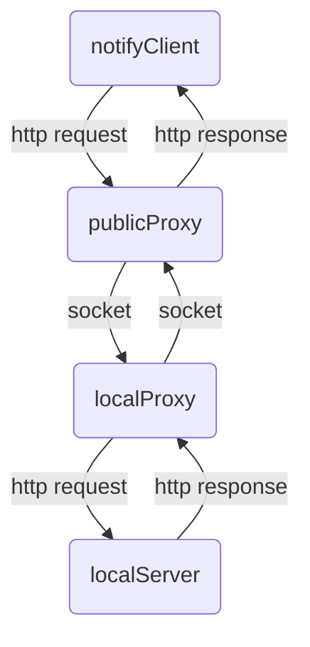
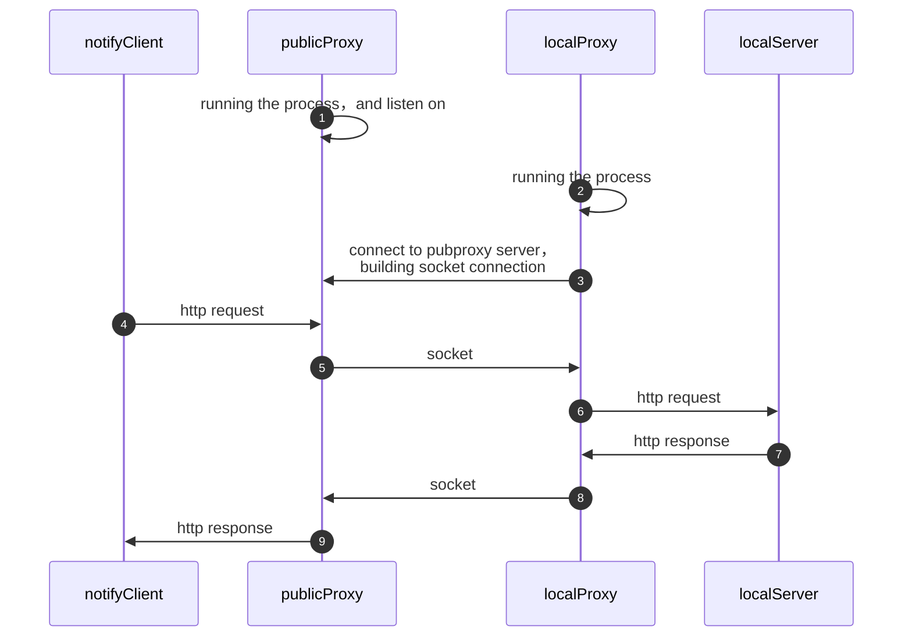

# Pub2LocProxy
一个将HTTP请求从公网转发到本地服务器的工具。 
 
可以用于本地环境调试公网的一些通知回调服务，例如支付通知回调服务等。
# 如何使用
## 1. pubproxy的配置文件
```yaml
pubproxy:
  server_addr: 0.0.0.0:9900 #the addr of pubproxy server for locproxy client
  input_addr: ":9920" #the addr of pubproxy server for notify client
  user_map:
    "xxxxxxxx":
      access_key: "xxxxxxxx"
      secret: "yyyyyyyyy"
    "abc":
      access_key: "def"
      secret: "ghi"
```

## 2. localproxy的配置文件
```yaml
locproxy:
  forward: 127.0.0.1:9910 #the addr of local server
  server_addr: 114.xxx.xxx.xxx:9900 #the pubproxy server addr
  register_route: 
  user:
    access_key: "xxxxxxxx"
    secret: "yyyyyyyyy"

```

## 3. 启动代理服务的进程
1. `./pub2locproxy pubproxy --config conf/app.yaml`在公网环境的服务器上运行.

output:
```
pub2locproxy pubproxy --config conf/app.yaml
ScanConfig: conf/app.yaml
2024/11/19 23:54:51 addrForInput:  :9920
2024/11/19 23:54:51 addrForClient:  0.0.0.0:9900
```

2. `./pub2locproxy locproxy --config conf/app.yaml`在本地机器上运行，启动后它会连接pubproxy服务端.

output in loclproxy console:
```
pub2locproxy locproxy --config conf/app.yaml
ScanConfig: conf/app.yaml
2024/11/19 23:56:43 cnf.Forward.RegisterRoute empty!
2024/11/19 23:56:43 natGwServerAddr:  127.0.0.1:9900
2024/11/19 23:56:43 authToken write begin
2024/11/19 23:56:43 authConfirm read begin
2024/11/19 23:56:43 AuthOK
2024/11/19 23:56:43 registerRoutePattern write begin
2024/11/19 23:56:43 registerConfirm read begin
2024/11/19 23:56:43 RouteRegistedOK
2024/11/19 23:56:43 forwardConnection4 begin:  127.0.0.1:9910
2024/11/19 23:56:43 proxyServerConn ReadRequest full:
```
output in publproxy console:
```
2024/11/19 23:56:43 a client has been connected!
2024/11/19 23:56:43 authToken read begin
2024/11/19 23:56:43 AuthOK write begin
2024/11/19 23:56:43 register route read begin
2024/11/19 23:56:43 register route read case 2 begin
2024/11/19 23:56:43 register route: 
2024/11/19 23:56:43 RouteRegistedOK write begin
```

## 4. 测试
1. `./pub2locproxy test local-server --address ":9910"`在本地机器挂起一个测试的本地服务进程.

output:
```
pub2locproxy test local-server --address ":9910"
Can't read config: Config File ".cobra" Not Found in "[/Users/yuanfei]"
2024/11/20 00:03:53 Starting Target HTTP server on:  :9910
```

2. `./pub2locproxy test send --url "http://127.0.0.1:9920"`发生一个http 请求给pubproxy进程.

ouput:
```
pub2locproxy test send --url "http://127.0.0.1:9920"
Can't read config: Config File ".cobra" Not Found in "[/Users/yuanfei]"
2024/11/20 00:05:48 ioutil.ReadAll(resp.Body) begin
2024/11/20 00:05:48 ioutil.ReadAll(resp.Body) end
Response headers: map[Content-Length:[13] Content-Type:[text/plain; charset=utf-8] Date:[Tue, 19 Nov 2024 16:05:48 GMT] X-Custom-Resp-Header-A:[A-value] X-Custom-Resp-Header-B:[B-value]]
Response body: Hello, World!
```

output in local server console:
```
2024/11/20 00:05:48 catched request!
2024/11/20 00:05:48 request headers: map[Accept-Encoding:[gzip] User-Agent:[Go-http-client/1.1] X-Request-Custom-Header-A:[Req-A-Value] X-Request-Custom-Header-B:[Req-B-Value]]
2024/11/20 00:05:48 request body: request body....
2024/11/20 00:05:48
```

output in pubproxy:
```
2024/11/20 00:05:48 a input request has been connected!
2024/11/20 00:05:48 serverCh new input conn!
2024/11/20 00:05:48 read request from input conn
2024/11/20 00:05:48 read request send to route:  ; forward conn: 127.0.0.1:58885
2024/11/20 00:05:48 matchedConn  --> inputConn begin
2024/11/20 00:05:48 ReadResponse begin
2024/11/20 00:05:48 ReadResponse over, write into inputConn begin
2024/11/20 00:05:48 write into inputConn over
```

output in locproxy console:
```
2024/11/20 00:05:48 proxyServerConn ReadString: &{GET http://127.0.0.1:9910/aaa/bb/ddd HTTP/1.1 1 1 map[Accept-Encoding:[gzip] User-Agent:[Go-http-client/1.1] X-Request-Custom-Header-A:[Req-A-Value] X-Request-Custom-Header-B:[Req-B-Value]] 0x14000020bc0 <nil> -1 [chunked] false 127.0.0.1:9920 map[] map[] <nil> map[]   <nil> <nil> <nil> <nil>} ; err: <nil>
2024/11/20 00:05:48 http.DefaultClient.Do(request):
2024/11/20 00:05:48 proxyServerConn ReadRequest full:
```

# 如何工作的
请求转发路径：


时序图:

